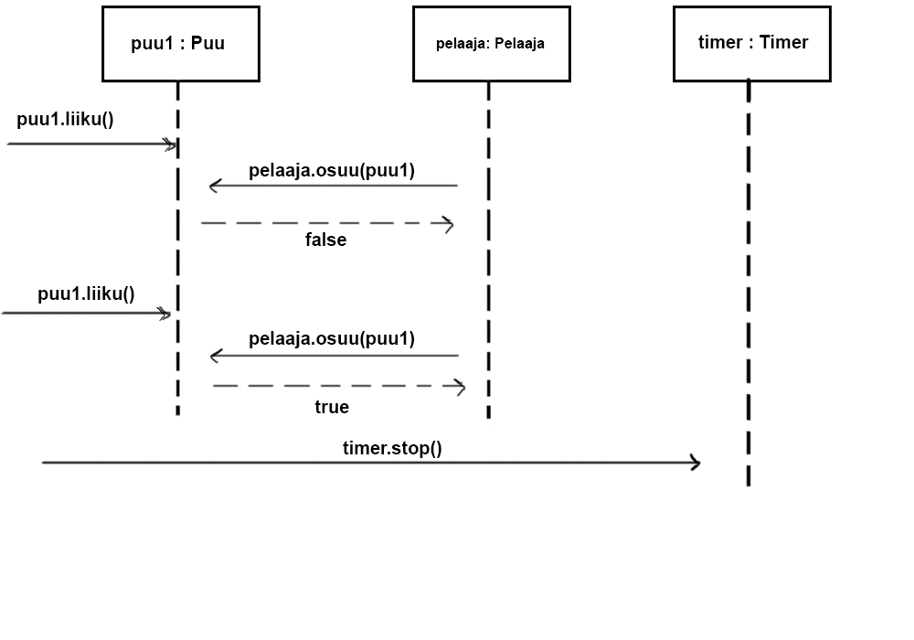
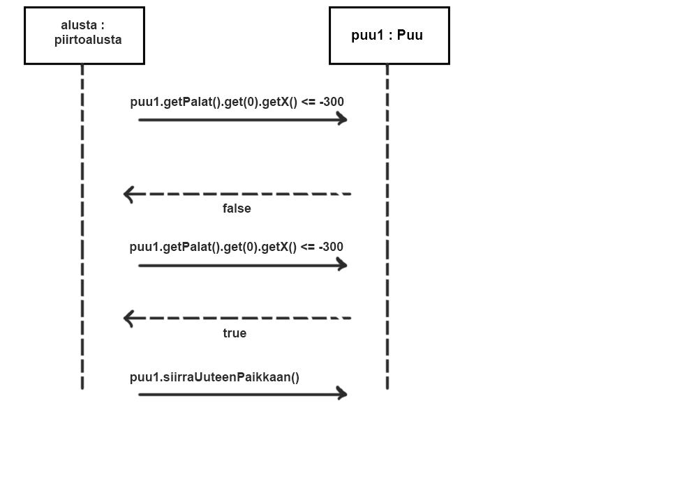

#Aiheen kuvaus ja rakenne

Aiheenani on "Lentsikkapeli", jossa pelaajan on tarkoitus pit‰‰
lentokone mahdollisimman pitk‰‰n ilmassa. Kone putoaa koko ajan, mutta
pelaaja voi nostaa korkeutta nappia painamalla. 
Lentokoneen ilmassapitoa vaikeuttavat erilaiset esteet, kuten puiden latvat 
ja linnut.

Hahmot koostuvat palasista, jotka kuvaavat hahmojen osuma-alaa tai 
"hitboxeja". Ensimm‰isess‰ toimivassa versiossa  tarkoituksena on vain
piirt‰‰ n‰m‰ palaset, mutta myˆhemm‰ss‰ vaiheessa palaset pyrit‰‰n
korvaamaan .png-muodossa olevilla kuvilla.

##Luokkakaavio

##Sekvenssikaaviot

